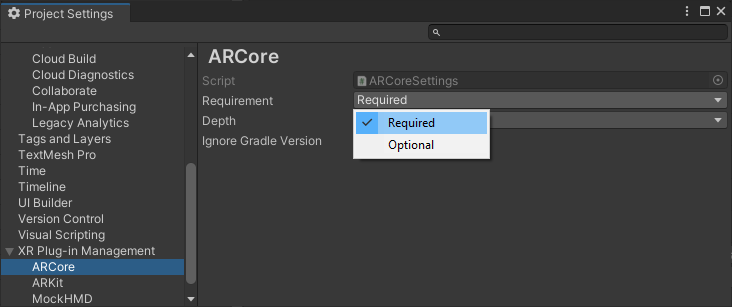
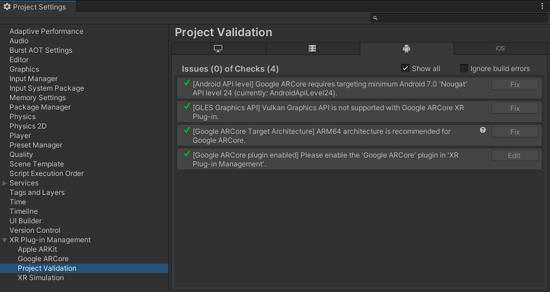

# Project configuration

Use the **XR Plug-in Management** settings to configure the Google ARCore plug-in for your project.

To get started, follow the instructions in [Enable the ARCore plug-in](#enable-the-google-arcore-plug-in). This also installs the ARCore package, if needed. Once installed and enabled, you can configure your project settings as described in the [ARCore Project settings](#arcore-project-settings) section.

You can review the [Project validation](#project-validation) section of the **XR Plug-in Management** settings to discover if any setting values are incompatible with ARCore.

## ARCore Project settings

Some ARCore features require specific Unity Project settings to function properly. The settings include:

* **[Google ARCore XR plug-in enabled](#enable-arcore)**: must be enabled to use ARCore features.
* **[Android API level](#api-level)**: the minimum Android varies with the version of the ARCore plug-in and Unity Editor. Checked by the project validation system.
* **[Graphics API](#graphics-api)**: the ARCore plug-in supports both OpenGLES and Vulkan Graphics APIs.
* **[Scripting Backend](#scripting-backend)**: you must use IL2CPP to use ARM64, which is the recommended target architecture.
* **[Target Architectures](#target-architecture)**: ARM64 is recommended so that your app can run on all 64-bit devices.
* **[ARCore support Requirement](#arcore-required)**: can be set to **optional** or **required** depending on whether your app can be used without ARCore support.
* **[ARCore Depth support](#arcore-depth-required)**: can be set to **optional** or **required** depending on whether your app can be used without ARCore depth information.
* **[Ignore Gradle Version](#gradle-version)**: can be enabled to silence Gradle version warnings, typically from using a custom Gradle setup.

### Enable the Google ARCore plug-in

To use ARCore, you must enable the plug-in in your **XR Plug-in Management** settings. (Installing the package from the Package Manager does not automatically enable the plug-in.)

> [!NOTE]
> Enabling ARCore also installs the package, if necessary. However, disabling ARCore does not uninstall the package.

You must install the **Android Module** using the Unity Hub before you can enable the ARCore plug-in. See the [Add modules](https://docs.unity3d.com/hub/manual/AddModules.html) section of the Unity Hub documentation for instructions.

To enable ARCore:

1. Open the **Project Settings** window (menu: **Edit &gt; Project Settings**).
2. Select **XR Plug-in Management** to view the plug-in management settings.
3. Select the **Android** tab to view the Android settings. (This tab is only shown when you have installed the Editor Android Module.)
4. Enable the **ARCore** option in the **Plug-in Providers** list.

    *Enabling ARCore*

### Set the Android API Level

The minimum version of Android that supports ARCore varies with which versions of the ARCore plug-in and Unity Editor you are using. Use the [Project Validation](#project-validation) system to check this setting and, if necessary, change it to a supported level.

To check the API level:

1. Open the **Project Settings** window (menu: **Edit &gt; Project Settings**).
2. Click **XR Plug-in Management** on the left to open the plug-in provider list.
3. Select **Project Validation** in the list to view the validation page.
4. Select the **Android** tab to view the status of the validation checks for XR plug-ins on the Android platform, including ARCore.
5. If the **Android API level** check appears with a red error icon, the current setting is too low. Click the **Fix** button to raise the API level to the minimum supported value.

    *Use the Project Validation page to check the Android API level*

> [!TIP]
> Enable the **Show all** option if the **Android API level** check is not shown (because the current setting passes validation). The validation message shown in the issue list contains the minimum API level for your current configuration.

You can also change the setting manually in the Player settings. To find the minimum API level setting:

1. Open the **Project Settings** window (menu: **Edit &gt; Project Settings**).
2. Select **Player** on the left to view the **Player Settings** page.
3. Select the **Android** tab to view the Android settings.
4. Open the **Other Settings** group (if necessary).
5. Scroll down to the **Configuration** section.

### Set the Graphics API

The ARCore plugin is compatible with both OpenGL ES and Vulkan Graphics APIs.

To set the Graphics API:

1. Open the **Project Settings** window (menu: **Edit &gt; Project Settings**).
2. Select **Player** on the left to view the **Player Settings** page.
3. Select the **Android** tab to view the Android settings.
4. Open the **Other Settings** group (if necessary).
5. In the **Rendering** section, uncheck the **Auto Graphics API** option (if enabled).
6. To use the OpenGL ES Graphics API - In the **Graphics APIs** list:
   * Add **OpenGLES3** if it does not appear in the list.
   * Drag **OpenGLES3** to the top of the list if it is not the first API in the list.
7. To use the Vulkan Graphics API - In the **Graphics APIs** list:
   * Add **Vulkan** if it does not appear in the list.
   * Drag **Vulkan** to the top of the list if it is not the first API in the list.
8. In addition, to use the Vulkan Graphics API with the Universal Render Pipeline: Locate your active `Universal Renderer` asset. In its **Inspector**, add an `ARCommandBufferSupportRendererFeature` to the list of **Renderer Features**.

> [!NOTE]
> It is recommended to use OpenGLES3 as the second Graphics API when using Vulkan as the first Graphics API and AR is 'Required', so that devices that do not support the needed Vulkan extension fall back to a working renderer.

### Set the Target Architecture

Unity recommends that you always enable the ARM64 target architecture for ARCore projects. If you only support, ARMv7, which is a 32-bit architecture, your app cannot be installed through the Google Playstore on 64-bit devices. In addition, 32-bit ARCore libraries are no longer available on some 64-bit devices, so your app could fail to create an AR session or crash if installed outside the Playstore. See [ARCore 64-bit requirement](https://developers.google.com/ar/64bit) in Google's ARCore documentation for more information.

To set the Android target architecture:

1. Open the **Project Settings** window (menu: **Edit &gt; Project Settings**).
2. Select **Player** on the left to view the **Player Settings** page.
3. Select the **Android** tab to view the Android settings.
4. Open the **Other Settings** group (if necessary).
5. Scroll down to the **Configuration** section.
6. Under **Target Architectures**, enable the ARM64 option.

> [!NOTE]
> Before you can enable the ARM64 architecture, you must [Set the Scripting Backend](#scripting-backend) to **IL2CPP**. The Mono backend does not support ARM64.

### Set the Scripting Backend

To use the recommended ARM64 architecture, you must also use the IL2CPP scripting backend.

To set the IL2CPP scripting backend:

1. Open the **Project Settings** window (menu: **Edit &gt; Project Settings**).
2. Select **Player** on the left to view the **Player Settings** page.
3. Select the **Android** tab to view the Android settings.
4. Open the **Other Settings** group (if necessary).
5. Scroll down to the **Configuration** section.
6. For **Scripting Backend**, choose **IL2CPP**.

See [IL2CPP Overview](xref:IL2CPP) for more information about the IL2CPP scripting backend.

### Set the ARCore support requirement

If your app cannot function without ARCore support, you can prevent it from being installed on devices without ARCore support using the ARCore plug-in **Requirement** setting. Choose **Required** if your app only works with ARCore support. Choose **Optional** if your app works with or without ARCore.

You must install the ARCore package before you can change the ARCore **Requirement** setting. See [Enable the Google ARCore plug-in](#enable-arcore) for instructions.

To change this setting:

1. Open the **Project Settings** window (menu: **Edit &gt; Project Settings**).
2. Click **XR Plug-in Management** on the left to open the plug-in provider list.
3. Select **ARCore** in the list to view the ARCore plug-in settings page.

    *ARCore plug-in settings*

4. For **Requirement**, choose either **Optional** or **Required**.

> [!NOTE]
> If you set ARCore as **Required** and install your app on a device that does not support ARCore -- which you can do using Unity's **Build and Run** feature or by "side-loading" via USB -- the device will incorrectly report that ARCore is available. (This is because the Google Play Store prevents the installation of apps that require ARCore on unsupported devices, so these apps always assume they're running on a supported device.)

### Set ARCore Depth support

If your app cannot function without ARCore depth support, you can prevent it from being installed on devices without depth support by setting the ARCore plug-in **Depth** setting to **Required**. Alternately, if your app can function acceptably without depth information, you can make support optional. See [Depth adds realism](https://developers.google.com/ar/develop/depth#unity-ar-foundation) in Google's ARCore documentation for more information about the ARCore depth feature.

To change this setting:

1. Open the **Project Settings** window (menu: **Edit &gt; Project Settings**).
2. Click **XR Plug-in Management** on the left to open the plug-in provider list.
3. Select **ARCore** in the list to view the ARCore plug-in settings page.
4. For **Depth**, choose either **Optional** or **Required**.

### Ignore Gradle Version

When you build an Android Player with ARCore enabled, the ARCore package checks the Gradle version and warns you if it determines the Gradle version to be too low. The version of Gradle required depends on the version of the Unity Editor you are using. Normally, the required version of Gradle is installed when you add Android Build support using the Unity Hub. However, if you use a custom Android SDK or Gradle setup, a version mismatch could occur. If you have verified that your installed version of Gradle works for your purposes, you can silence this warning by enabling the **Ignore Gradle Version** option.

To change this setting:

1. Open the **Project Settings** window (menu: **Edit &gt; Project Settings**).
2. Click **XR Plug-in Management** on the left to open the plug-in provider list.
3. Select **ARCore** in the list to view the ARCore plug-in settings page.
4. Click the checkbox for **Ignore Gradle Version**, to enable or disable the option.

See [Gradle for Android](xref:android-gradle-overview) for more information about Gradle.

## Project validation

The Google ARCore package defines a set of rules for the Project Validation system. These rules check for possible incompatibilities between ARCore and the project configuration.

Some of the rules serve as warnings for possible configuration problems; you are not required to fix these. Other rules flag configuration errors that would result in your app failing to build or not working once built. You must fix these errors.

To review the ARCore project validation results:

1. Open the **Project Settings** window (menu: **Edit &gt; Project Settings**).
2. Click **XR Plug-in Management** on the left to open the plug-in provider list.
3. Select **Project Validation** in the list to view the validation page.
4. Select the **Android** tab to view the status of the validation checks for XR plug-ins on the Android platform, including ARCore.

Rules that pass validation are not shown unless you enable **Show all**.

Some rules provide a **Fix** button that updates the configuration so that the rule passes validation. Other rules provide an **Edit** button that takes you to the relevant setting so that you can make the necessary adjustments yourself.

You can enable **Ignore build errors** to bypass the pre-build validation check. However, any misconfigured features in your app might not work at runtime.

 *The Android Project Validation section of the XR Plug-in Management page*

